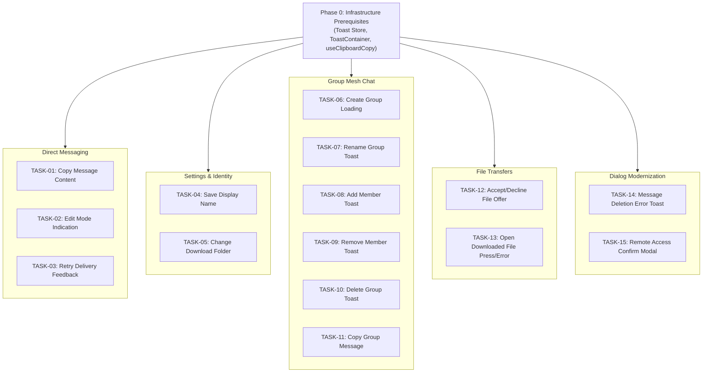

# Link LAN Messenger — UI Feedback Implementation Tasks

This document translates the recommendations from [`UI_FEEDBACK_AUDIT.md`](file:///c:/Dev/Link/UI_FEEDBACK_AUDIT.md) into concrete, actionable, and testable engineering tasks.

---

## Technical Foundation & Prerequisites

Before implementing the individual UI feedback items, the following shared infrastructure components must be in place to avoid code duplication and ensure uniform UX across the application.

- [x] **T000: Shared Infrastructure — Global Toast System & Copy Feedback Hook**
  - **Files**:
    - `src/stores/toast.store.ts` (new)
    - `src/components/design-system/ToastContainer.tsx` (new)
    - `src/hooks/useClipboardCopy.ts` (new)
  - **Scope**:
    1. Create a lightweight Zustand store `useToastStore` managing an array of notifications `{ id, message, type: 'info' | 'success' | 'warning' | 'error', duration?: number }` with `addToast(msg, type, duration?)` and `removeToast(id)`.
    2. Build `<ToastContainer />` positioned fixed at bottom-right or top-center, styled with glassmorphism / matte tokens from `tokens.css`, rendering icons for each toast type (`<CheckCircle />`, `<AlertTriangle />`, `<Info />`, `<XCircle />`) with entry/exit animations.
    3. Mount `<ToastContainer />` inside `AppShell.tsx` so toasts are globally visible across all views.
    4. Create `useClipboardCopy(timeout = 1500)` hook returning `{ copied, copy(text) }` for standardized copy micro-states.

---

## Task Matrix: 15 Targeted UI Feedback Enhancements

### 1. Copy Message Content
- **Task ID**: `TASK-01`
- **Priority**: Critical
- **Source File**: [`src/components/conversations/MessageBubble.tsx`](file:///c:/Dev/Link/src/components/conversations/MessageBubble.tsx#L194-L200)
- **Current Behavior**: Clicking `<Copy />` copies message text silently. The icon and tooltip remain unchanged.
- **Desired UI Feedback**:
  - On click, icon immediately morphs from `<Copy size={12} />` to `<Check size={12} color="var(--status-online)" />` for 1500ms.
  - Tooltip updates from `"Copy"` to `"Copied!"`.
  - Icon and tooltip seamlessly revert after timeout.
- **Implementation Steps**:
  1. Use `useClipboardCopy()` or add local `isCopied` state to `MessageBubble.tsx`.
  2. In the copy button render block (L194–L200), check `isCopied`.
  3. Render `<Check />` with green accent when copied; update button title dynamically.
- **Acceptance Criteria**:
  - [x] Clicking copy button on any direct message bubble immediately displays green checkmark.
  - [x] Hover tooltip reads "Copied!".
  - [x] Reverts back to `<Copy />` after 1.5 seconds without layout shifts.

---

### 2. Message Edit Mode Indication
- **Task ID**: `TASK-02`
- **Priority**: High
- **Source Files**:
  - [`src/components/conversations/ConversationView.tsx`](file:///c:/Dev/Link/src/components/conversations/ConversationView.tsx#L649-L654)
  - [`src/components/conversations/MessageInput.tsx`](file:///c:/Dev/Link/src/components/conversations/MessageInput.tsx#L257-L298)
- **Current Behavior**: Clicking "Edit" populates input and alters send button, but no banner indicates edit mode or identifies the target message.
- **Desired UI Feedback**:
  - Display an "Editing message" banner immediately above `MessageInput` matching the design of the Replying banner.
  - Include an `<Edit2 size={14} />` icon, "Editing message" heading, original message excerpt, and a close button `(X)`.
  - Support pressing `Escape` to cancel editing.
- **Implementation Steps**:
  1. In `ConversationView.tsx`, resolve `editingMessage` when `editingMessageId` is present.
  2. Render the banner above `MessageInput` (mirroring L615–L645 reply banner), showing truncated content.
  3. Pass `onCancelEdit` handler to clear `editingMessageId`.
  4. In `MessageInput.tsx`, attach an `Escape` key listener in `handleKeyDown` that calls `onCancelEdit`.
- **Acceptance Criteria**:
  - [x] Entering edit mode shows an "Editing message" banner above the input container.
  - [x] Original message excerpt is visible with an edit icon.
  - [x] Clicking `(X)` or pressing `Escape` clears edit mode and resets input text.

---

### 3. Retry Failed Delivery
- **Task ID**: `TASK-03`
- **Priority**: Medium
- **Source File**: [`src/components/conversations/MessageBubble.tsx`](file:///c:/Dev/Link/src/components/conversations/MessageBubble.tsx#L58-L68)
- **Current Behavior**: Clicking the red alert triangle triggers `onRetry`, but the icon remains static until network returns.
- **Desired UI Feedback**:
  - Clicking the retry trigger initiates an active re-transmission visual state.
  - Icon transitions into a spinning reload icon (`<RotateCw size={12} className="spin-animation" />`) or pulses for the duration of the dispatch.
  - Tooltip updates to `"Retrying delivery..."`.
- **Implementation Steps**:
  1. Add `isRetrying` state to `MessageBubble.tsx`.
  2. Set `isRetrying = true` when `onRetry` is clicked; reset after asynchronous dispatch or 1500ms timeout.
  3. Render spinning `<RotateCw />` while `isRetrying` is active.
- **Acceptance Criteria**:
  - [x] Clicking failed message warning icon provides immediate rotation/pulse feedback.
  - [x] Cursor changes to waiting/default state during active retry.

---

### 4. Save Display Name
- **Task ID**: `TASK-04`
- **Priority**: High
- **Source File**: [`src/components/settings/SettingsPanel.tsx`](file:///c:/Dev/Link/src/components/settings/SettingsPanel.tsx#L148-L173)
- **Current Behavior**: User clicks "Save". Button becomes disabled without text change or feedback.
- **Desired UI Feedback**:
  - Button transitions to success state for 1500ms: text changes to `<Check size={14} /> Saved!` with `var(--status-online)` background.
  - Global toast triggered: `"Display name updated"`.
- **Implementation Steps**:
  1. Add `isSaved` boolean state to `SettingsPanel.tsx`.
  2. Inside `handleSaveDisplayName`, after successful store update, set `isSaved = true`.
  3. Fire `toast.success("Display name updated")`.
  4. Reset `isSaved` after 1500ms.
- **Acceptance Criteria**:
  - [x] Save button indicates success micro-state with checkmark and "Saved!" text.
  - [x] Toast notification appears confirming name update.

---

### 5. Change Download Folder
- **Task ID**: `TASK-05`
- **Priority**: Low
- **Source File**: [`src/components/settings/SettingsPanel.tsx`](file:///c:/Dev/Link/src/components/settings/SettingsPanel.tsx#L295-L311)
- **Current Behavior**: User selects a new directory; path silently updates in the label.
- **Desired UI Feedback**:
  - Trigger toast confirmation: `"Download folder updated"`.
  - Briefly flash or highlight the updated path row with accent border color.
- **Implementation Steps**:
  1. In `handleChangeFolder` inside `SettingsPanel.tsx`, detect if path was changed.
  2. Trigger `toast.success("Download folder updated")`.
  3. Add a temporary highlight state on the path container.
- **Acceptance Criteria**:
  - [x] Changing download folder shows confirmation toast.
  - [x] Path updates visibly in settings with smooth transition.

---

### 6. Create New Group
- **Task ID**: `TASK-06`
- **Priority**: High
- **Source File**: [`src/components/groups/GroupCreate.tsx`](file:///c:/Dev/Link/src/components/groups/GroupCreate.tsx#L30-L39)
- **Current Behavior**: Button has no loading state while deriving mesh keys; modal abruptly vanishes.
- **Desired UI Feedback**:
  - Button enters loading state with spinner and text `"Creating group..."`, disabling multiple clicks.
  - On successful creation, close modal and trigger toast: `"Group '[Name]' created"`.
  - On failure, show error toast: `"Failed to create group"`.
- **Implementation Steps**:
  1. Add `isSubmitting` state in `GroupCreate.tsx`.
  2. Set `isSubmitting = true` in `handleCreate`.
  3. Render spinner inside button and disable inputs while `isSubmitting`.
  4. Call `toast.success(\`Group "${trimmed}" created\`)` before closing.
- **Acceptance Criteria**:
  - [x] "Create Group" button displays spinner and disables on click.
  - [x] Success toast displays new group name upon completion.

---

### 7. Rename Group
- **Task ID**: `TASK-07`
- **Priority**: Medium
- **Source File**: [`src/components/groups/GroupView.tsx`](file:///c:/Dev/Link/src/components/groups/GroupView.tsx#L619-L644)
- **Current Behavior**: Clicking Save closes the inline input with zero confirmation.
- **Desired UI Feedback**:
  - Close inline input and trigger toast: `"Group renamed to '[New Name]'"`.
- **Implementation Steps**:
  1. In `GroupView.tsx` save handler (L620–L622 and L633–L636), capture new name.
  2. Trigger `toast.success(\`Group renamed to "${newName}"\`)`.
- **Acceptance Criteria**:
  - [x] Renaming group triggers toast displaying the updated group name.
  - [x] View updates instantly without visual glitching.

---

### 8. Add Member to Group
- **Task ID**: `TASK-08`
- **Priority**: Medium
- **Source File**: [`src/components/groups/GroupView.tsx`](file:///c:/Dev/Link/src/components/groups/GroupView.tsx#L680-L689)
- **Current Behavior**: User selects peers and clicks "Add". Picker closes instantly without feedback.
- **Desired UI Feedback**:
  - Trigger toast: `"Added X member(s) to [Group Name]"`.
- **Implementation Steps**:
  1. In `GroupView.tsx` add members handler (L683–L687), record count of selected peers.
  2. Trigger `toast.success(\`Added ${count} member(s) to ${group.name}\`)`.
- **Acceptance Criteria**:
  - [x] Adding members generates a toast with accurate member count and group name.

---

### 9. Remove Member from Group
- **Task ID**: `TASK-09`
- **Priority**: Medium
- **Source File**: [`src/components/groups/GroupView.tsx`](file:///c:/Dev/Link/src/components/groups/GroupView.tsx#L783-L790)
- **Current Behavior**: Clicking "Remove" removes member with no feedback.
- **Desired UI Feedback**:
  - Trigger toast: `"Removed [Member Name] from [Group Name]"`.
- **Implementation Steps**:
  1. In `GroupView.tsx` remove member handler (L785–L788), capture member display name.
  2. Trigger `toast.info(\`Removed ${m.displayName} from ${group.name}\`)`.
- **Acceptance Criteria**:
  - [x] Member removal triggers confirmation toast specifying the removed member's name.

---

### 10. Delete Group
- **Task ID**: `TASK-10`
- **Priority**: Medium
- **Source File**: [`src/components/groups/GroupView.tsx`](file:///c:/Dev/Link/src/components/groups/GroupView.tsx#L714-L721)
- **Current Behavior**: Clicking "Yes, Delete" clears group and abruptly shows empty screen.
- **Desired UI Feedback**:
  - Trigger toast: `"Group '[Name]' deleted"`.
- **Implementation Steps**:
  1. In `GroupView.tsx` delete confirmation button handler (L716–L719), store group name.
  2. Call `toast.info(\`Group "${group.name}" deleted\`)`.
- **Acceptance Criteria**:
  - [x] Deleting a group triggers informational toast confirming deletion.

---

### 11. Copy Group Message
- **Task ID**: `TASK-11`
- **Priority**: Critical
- **Source File**: [`src/components/groups/GroupView.tsx`](file:///c:/Dev/Link/src/components/groups/GroupView.tsx#L112-L115)
- **Current Behavior**: Copies group message to clipboard silently. Copy icon lacks micro-state.
- **Desired UI Feedback**:
  - Button micro-state: Morph `<Copy />` into `<Check color="var(--status-online)" />` for 1500ms and update tooltip to `"Copied!"`.
- **Implementation Steps**:
  1. Integrate `useClipboardCopy` or track `copiedMessageId` in `GroupView.tsx`.
  2. In message action toolbar, check if current message ID is copied.
  3. Render `<Check />` icon and `"Copied!"` tooltip during active state.
- **Acceptance Criteria**:
  - [ ] Clicking copy on group message transforms icon into checkmark for 1.5s.
  - [ ] Multiple rapid clicks do not break timer or layout.

---

### 12. Accept / Decline File Offer
- **Task ID**: `TASK-12`
- **Priority**: High
- **Source File**: [`src/components/file-transfer/FileTransferOffer.tsx`](file:///c:/Dev/Link/src/components/file-transfer/FileTransferOffer.tsx#L104-L146)
- **Current Behavior**: Modal dismisses immediately upon clicking Accept or Decline without feedback.
- **Desired UI Feedback**:
  - On Accept: Trigger toast: `"Transfer accepted — downloading '[File Name]' to Link folder"`.
  - On Decline: Trigger toast: `"Transfer declined for '[File Name]'"`.
- **Implementation Steps**:
  1. In `handleAccept` (L127–L146), call `toast.success(\`Transfer accepted — downloading "${offer.fileName}"\`)`.
  2. In `handleDecline` (L105–L124), call `toast.info(\`File transfer declined for "${offer.fileName}"\`)`.
- **Acceptance Criteria**:
  - [ ] Accepting file offer shows clear toast indicating download has started.
  - [ ] Declining offer shows dismissal toast.

---

### 13. Open Downloaded File / Folder
- **Task ID**: `TASK-13`
- **Priority**: Medium
- **Source File**: [`src/components/file-transfer/SessionDownloads.tsx`](file:///c:/Dev/Link/src/components/file-transfer/SessionDownloads.tsx#L132-L156)
- **Current Behavior**: Clicking downloaded file row invokes IPC silently. If file was moved or deleted on disk, nothing happens.
- **Desired UI Feedback**:
  - Add active press state on the row (`transform: scale(0.99)`, background highlight).
  - If open operation fails or file does not exist, trigger error toast: `"File could not be opened or has been moved"`.
- **Implementation Steps**:
  1. Add `:active` CSS styling to transfer row in `SessionDownloads.tsx`.
  2. Wrap IPC call in try/catch or inspect returned status.
  3. On failure, trigger `toast.error("File could not be opened or has been moved")`.
- **Acceptance Criteria**:
  - [ ] Clicking row provides immediate tactile press feedback.
  - [ ] Missing file triggers descriptive error toast.

---

### 14. Message Deletion Error
- **Task ID**: `TASK-14`
- **Priority**: Critical
- **Source File**: [`src/components/conversations/ConversationView.tsx`](file:///c:/Dev/Link/src/components/conversations/ConversationView.tsx#L141)
- **Current Behavior**: Calls blocking `window.alert('Failed to delete message. The teammate may be offline or unreachable.')`.
- **Desired UI Feedback**:
  - Replace blocking `window.alert` with non-blocking error toast: `toast.error('Failed to delete message. The teammate may be offline or unreachable.')`.
- **Implementation Steps**:
  1. Replace `window.alert` call in `handleDeleteMessage` catch block (L141) with `toast.error(...)`.
- **Acceptance Criteria**:
  - [ ] Deletion error displays an in-app error toast without freezing the renderer or popping a native dialog.

---

### 15. Remote Access During File Transfer
- **Task ID**: `TASK-15`
- **Priority**: High
- **Source File**: [`src/components/remote-access/RemoteAccessButton.tsx`](file:///c:/Dev/Link/src/components/remote-access/RemoteAccessButton.tsx#L31-L35)
- **Current Behavior**: Uses blocking `window.confirm("A file transfer is currently active... Continue?")`.
- **Desired UI Feedback**:
  - Replace blocking `window.confirm` with an in-app confirmation modal or prompt dialog styled according to `tokens.css`.
  - Non-blocking flow with "Cancel" and "Continue" buttons.
- **Implementation Steps**:
  1. Add `showTransferWarningModal` boolean state to `RemoteAccessButton.tsx`.
  2. When active transfer is detected, toggle `showTransferWarningModal = true` instead of calling `window.confirm`.
  3. Render modal overlay with warning details, "Cancel", and "Continue" buttons.
  4. Proceed with `requestAccess` only when user confirms.
- **Acceptance Criteria**:
  - [ ] Initiating remote access during file transfer opens modern in-app warning modal.
  - [ ] Native OS dialog is completely eliminated.
  - [ ] User can cancel or proceed smoothly without thread freezing.

---

## Implementation Sequence & Dependencies

